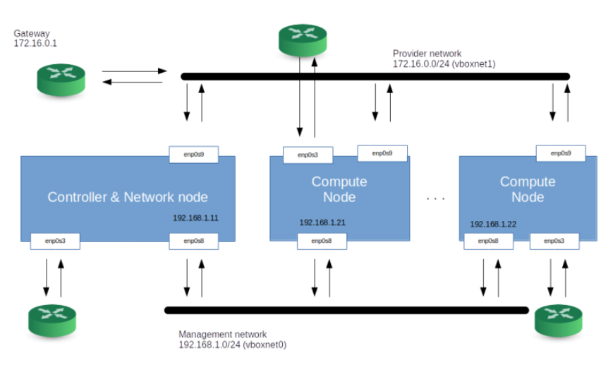
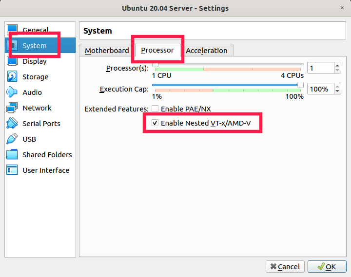

# openstack-labs
## Setting up our OpenStack-Playground

This work is based on [setting up your own OpenStack playground](https://leftasexercise.com/2020/01/27/setting-up-our-openstack-playground/) because the necessity to practice OpenStack knowledge in a free environment, it means no risk to mess up a production OpenStack environment

The source for this work can be found at: [GIT repository](https://github.com/christianb93/openstack-labs) In this lab we will describe the setup of our Lab environment ans install basic infratructure services that OpenStack uses.

To avoid confussion, let us first fix some terms. First, there is an actual physical machine on which the Labs will run, in fact is this pc I'm using to write down this post, let's call this machine **PC**.
On this **PC**, we will run virtual Box to create virtual machines. One of this virtual machines will be a Host to execute the **Ansible Scripts** let's call it **Ansible Host**. The virtual machines will be called the **Nodes**,  and they will play the role that in the real world setup. since Virtual Host is not compatible with Microsoft Hypervisor, we have to disable Windows Hypervisor which is being using with WSL

I am using Windows 10/11, and I need to run a the ansible scripts under **Ansible Host** machine, this host will be named **AnsibleHost**
We will be using one node named **controller node** on which most of the OpenStack components will run, and two **compute Nodes** (compute1 and compute2).

Inside the compute nodes, the Nova compute service will be installed to carete and provision virtual machines which we call **VMs**. So effectively , we use nested virtualization - the **VM** is itself running inside a virtual machine (the node). To enable a VirtualBox machine to use be have nested VMs use the settings described in [VBox Nested virtualization](https://docs.oracle.com/en/virtualization/virtualbox/6.0/admin/nested-virt.html) and  ["How to enable nested virtualization in virtualbox"](https://ostechnix.com/how-to-enable-nested-virtualization-in-virtualbox/) as

### Strategy
* Personal PC: Used to host Oracle Virtual Box using Vagrant
* Ansible Host: Used ti run Ansible scripts (Pre-requisites)
  * Ansible_Host_Packages.sh
* Controller
* Compute1 and Compute2

  To run the Labs, your host will need to have certain minimum amount of RAM, it is recomended to use 7-8 GB of RAM at the begining, which will increase depending on the number of VMs
* Lab1 [set up the playground and install basic infrastructure services](https://leftasexercise.com/2020/01/27/setting-up-our-openstack-playground/)
  * Vagrant store the private keys under .vagrant\machines\[machine Name]\virtualbox named private key, these private keys must be copied to the Ansible Host on ~/machines\[machine Name]\virtualbox

* Lab2 - [Install Keystone](https://leftasexercise.com/2020/02/03/openstack-keystone-installation-and-overview/)
[OpenStack Keystone – a deep-dive into tokens and policies](https://leftasexercise.com/2020/02/07/openstack-keystone-a-deep-dive-into-tokens-and-policies/)
* Lab3 [openstack-supporting-services-glance-and-placement](https://leftasexercise.com/2020/02/10/) (Install images  )
* Lab 4 [Install Nova](https://leftasexercise.com/2020/02/14/openstack-nova-installation-and-overview/)
* Lab5 [OpenStack Neutron installation – basic setup and our first instances](https://leftasexercise.com/2020/02/24/openstack-neutron-installation-basic-setup-and-our-first-instances/)
* Lab8 - [Install a virtual router using the Neutron L3 agent](https://leftasexercise.com/2020/03/16/building-virtual-routers-with-openstack/)
* Lab9 - Allow a tenant to provision VXLAN networks
* Lab10 - [Introduce a separate network node on which the Neutron agents run](https://leftasexercise.com/2020/03/30/openstack-neutron-handling-instance-metadata/)
* Lab11 - Play with iSCSI
* Lab12 - LVM playground
* Lab13 - [Install Cinder](https://leftasexercise.com/2020/04/)
* Lab13 - Install Cinder
* Lab14 - Octavia as stand-alone loadbalancer

* Others: [Running your own cloud with OpenStack](running-your-own-cloud-with-openstack-overview)
* Nova: [OpenStack Nova – deep-dive into the provisioning process](https://leftasexercise.com/2020/02/17/openstack-nova-deep-dive-into-the-provisioning-process/) actually this is where the servers creation is

 ** Lab 2:
 ** Lab 3: [OPenStack Glance Documentation](https://docs.openstack.org/glance/latest/)

 ### Enable Nested Virtualization in Virtual Box
There are 3 ways to enable Nested [Virtualization in Virtual Box](https://ostechnix.com/how-to-enable-nested-virtualization-in-virtualbox/)

- On VBoxManage
  VBoxManage modifyvm "Ubuntu 20.04 Server" --nested-hw-virt on
- On VBox GUI
  
- On Vagrantfile
  > virtualbox.customize ["modifyvm", :id, "--nested-hw-virt", "on"]

## References:
[GIT repository](https://github.com/christianb93/openstack-labs)
[Ansible Samples, not reviwed yet](https://github.com/christianb93/ansible-samples)

[playground instructions](https://leftasexercise.com/2020/01/27/setting-up-our-openstack-playground/)
[Openstack overview ](https://leftasexercise.com/2020/01/20/q-running-your-own-cloud-with-openstack-overview/)

