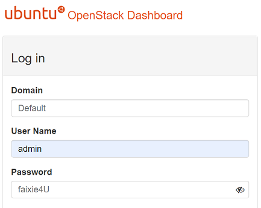

Create AnsibleHost and all the VMs to include in OpenStack and they will be included in the Ansible Inventory:
1. controller
2. compute1
3. compute2
4. network
5. storage

Execute vagrant in the follwoing order, AnsibleHost requires the OpenStack VMs must be up to create the SSH environment
> vagrant up  
> vagrant up AnsibleHost  

login into AnsibleHost
> vagrant ssh AnsibleHost
----
From AnsibleHost test the communication with the OpenStack servers defined in ansible/hosts.ini as:
> ansible all -m ping
````
    controller | SUCCESS => {
        "changed": false,
        "ping": "pong"
    }
    storage | SUCCESS => {
        "changed": false,
        "ping": "pong"
    }
    compute1 | SUCCESS => {
        "changed": false,
        "ping": "pong"
    }
    compute2 | SUCCESS => {
        "changed": false,
        "ping": "pong"
    }
    network | SUCCESS => {
        "changed": false,
        "ping": "pong"
    }

````
----
following commands use -vvv for deep verbosity
1. From AnsibleHost directory execute Infrastructure
> ansible-playbook 1-infrastructure/infrastructure.yaml -vvv
2. execute Infrastructure
> ansible-playbook 2-keystone/keystone.yaml -vvv
3. create a host entry on your local laptop as (running as Administrator)
    notepad c:\Windows\System32\drivers\etc\hosts
    or
    notepad /c/Windows/System32/drivers/etc/hosts
    Add: 192.168.100.11 controller
4. open your browser to: 
    controller/horizon
5. login into the horizon dasboard using:
    Domain: Default
    User Name: Admin
    Password: faixie4U

---
Horizon Login


---

if the password above does not work login into the controller VM and execute
> cat admin-openrc | grep OS_PASSWORD | awk -F '=' '{print $2}'

## Programmer OpenStack Infrastructure Notes
* When running for first time ansible script fail on Octavia
* On a second attempt succeed

